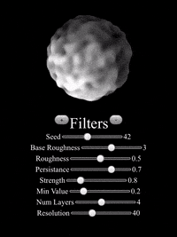

# planet-generator

Planet-like shape generator powered by Elm and WebGL. Try it out [https://wg-romank.github.io/planet-generator/]

This repository attemps to implement procedurial mesh generation using simplex noise. Repo contains basic shaders for ambient and diffuse lighting.

## References

This work was greatly inspired by Sebastian Lague's tutorial [https://www.youtube.com/watch?v=QN39W020LqU]

## Future work considerations

* Live height-based texture editing
* More advanced lightning using shadow volumes [http://nuclear.mutantstargoat.com/articles/volume_shadows_tutorial_nuclear.pdf]